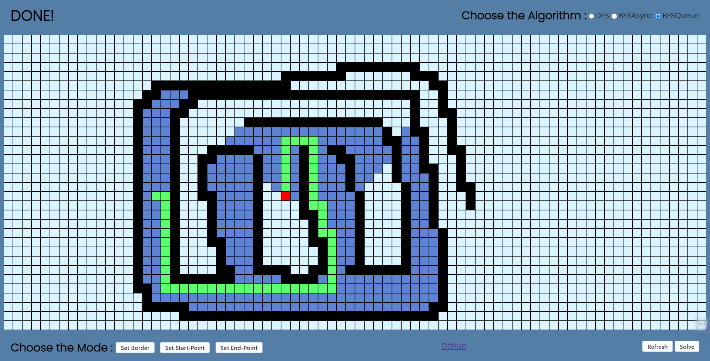

# Path Finding Visualiser

- This Project Visualizes all the major graph traversal algorithms like DFS , BFS and Dijkstra. 

- Built using simple HTML, CSS and JavaScript.

- The board is automatically scaled as per you screen resolution. Remember to select the algorithm to visualise.

**
You can find the website live <a href="https://ggs4ggs4.github.io/Path-Finding-Visualizer/">here</a>
**
